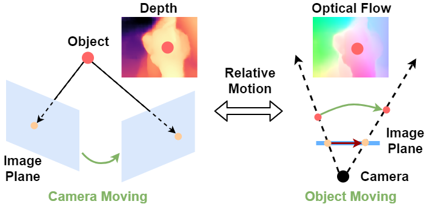
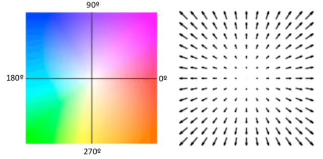
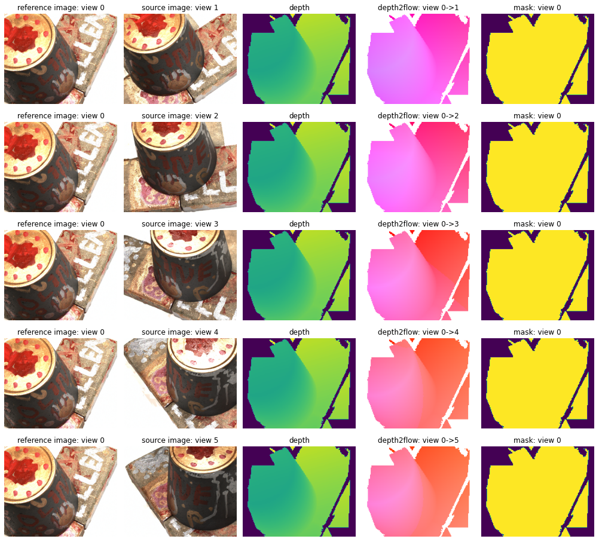
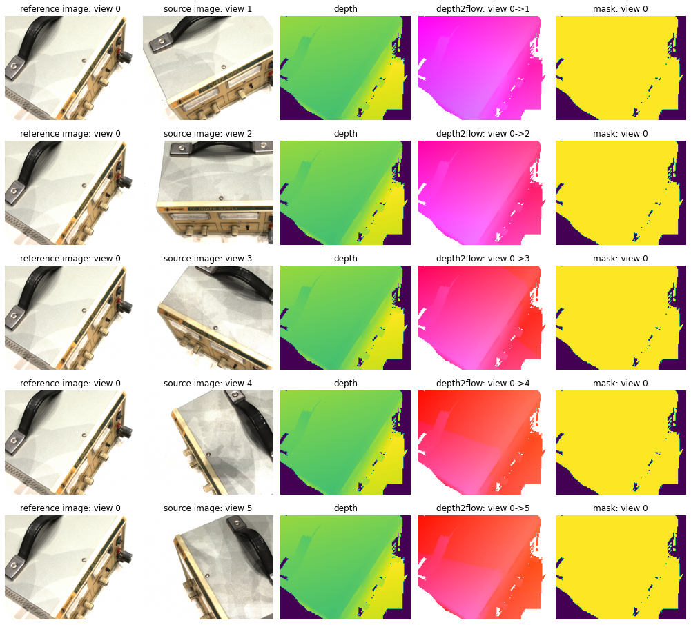

# Toy example of Depth2Flow module in the paper

## Brief Introduction

Here we provide a direct example of the Depth2Flow module in the paper. The following figure shows the basic intuition of Depth2Flow module.

<center>
    
    <br>
    <div style="color:orange; border-bottom: 1px solid #d9d9d9;
    display: inline-block;
    color: #999;
    padding: 2px;">Intuition of Depth2Flow module.</div>
</center>

Generally, we assume the object is static and the camera is moving in a multi-view stereo system. Considering the relative motion between camera and object, the stereo correspondence decided by the homography warping function can further be viewed as a special case of moving object represented by optical flow.

Inherited from the homography warping function: (More details are discussed in the paper)

$$\hat{p}_{i}^{j}=\operatorname{Norm}\left[D_{j}\left(\hat{p}_{i}^{j}\right) \hat{p}_{i}^{j}\right] = \operatorname{Norm}\left[ K_{j} T_{j}\left(K_{1} T_{1}\right)^{-1} D_{1}\left(p_{i}\right) p_{i} \right], \text{ where } \operatorname{Norm}\left([x, y, z]^{T}\right)=[x / z, y / z, 1]^{T}$$

Given the definition of optical flow:
$$\widehat{F}_{1 j}\left(p_{i}\right)=\hat{p}_{i}^{j}-p_{i}$$

We can easily transform the implicit stereo correspondence modeled in depth map to the 2D correspondence represented by optical flow:
$$
\widehat{F}_{1 j}\left(p_{i}\right)=\operatorname{Norm}\left[K_{j} T_{j}\left(K_{1} T_{1}\right)^{-1} D_{1}\left(p_{i}\right) p_{i}\right]-p_{i}
$$

It is noted that the whole process is differentiable.

## Code

The aforementioned formula is further transformed into the following code:

```Python
import torch

def depth_pose2flow(depth, ref_in, ref_ex, src_in, src_ex):
    """
    :param depth:    B x H x W
    :param ref_in:   B x 3 x 3
    :param ref_ex:   B x 4 x 4
    :param src_in:   B x 3 x 3
    :param src_ex:   B x 4 x 4
    :return:         B x 2 x H x W
    """
    batch = depth.shape[0]
    height, width = depth.shape[1], depth.shape[2]

    src_proj = torch.matmul(src_in, src_ex[:, 0:3, :])  # B x 3 x 4
    ref_proj = torch.matmul(ref_in, ref_ex[:, 0:3, :])  # B x 3 x 4
    last = torch.tensor([[[0, 0, 0, 1.0]]]).repeat(len(src_in), 1, 1).cuda()
    src_proj = torch.cat((src_proj, last), 1)  # B x 4 x 4
    ref_proj = torch.cat((ref_proj, last), 1)  # B x 4 x 4
    proj = torch.matmul(src_proj, torch.inverse(ref_proj))
    rot = proj[:, :3, :3]  # [B,3,3]
    trans = proj[:, :3, 3:4]  # [B,3,1]

    y, x = torch.meshgrid([torch.arange(0, height, dtype=torch.float32, device=depth.device),
                           torch.arange(0, width, dtype=torch.float32, device=depth.device)])
    y, x = y.contiguous(), x.contiguous()
    y, x = y.view(height * width), x.view(height * width)
    grid = torch.stack((x, y))  # [2, H*W]
    xyz = torch.stack((x, y, torch.ones_like(x)))  # [3, H*W]
    xyz = torch.unsqueeze(xyz, 0).repeat(batch, 1, 1)  # [B, 3, H*W]
    rot_xyz = torch.matmul(rot, xyz)  # [B, 3, H*W]
    d = depth.reshape(batch, height * width).unsqueeze(1)  # [B, 1, H*W]
    rot_depth_xyz = rot_xyz * d  # [B, 3, H*W]
    proj_xyz = rot_depth_xyz + trans  # [B, 3, H*W]
    proj_xy = proj_xyz[:, :2, :] / proj_xyz[:, 2:3, :].clamp(min=1e-3)  # [B, 2, H*W]
    flow = proj_xy - grid.unsqueeze(0)  # [B, 2, H*W]
    return flow.reshape(batch, 2, height, width)
```

## Toy experiment

Here we provide a [jupyter notebook](./depth2flow.ipynb) to evaluate and visualize the results.
You can modify the data path of the utilized DTU dataset with your own ones.

## Results

<center>
    
    <br>
    <div style="color:orange; border-bottom: 1px solid #d9d9d9;
    display: inline-block;
    color: #999;
    padding: 2px;">Template flow field.</div>
</center>

<center>
    
    <br>
    <div style="color:orange; border-bottom: 1px solid #d9d9d9;
    display: inline-block;
    color: #999;
    padding: 2px;">Scan1 of DTU.</div>
</center>

<center>
    
    <br>
    <div style="color:orange; border-bottom: 1px solid #d9d9d9;
    display: inline-block;
    color: #999;
    padding: 2px;">Scan9 of DTU.</div>
</center>

<center>
    
    <br>
    <div style="color:orange; border-bottom: 1px solid #d9d9d9;
    display: inline-block;
    color: #999;
    padding: 2px;">Scan11 of DTU.</div>
</center>
